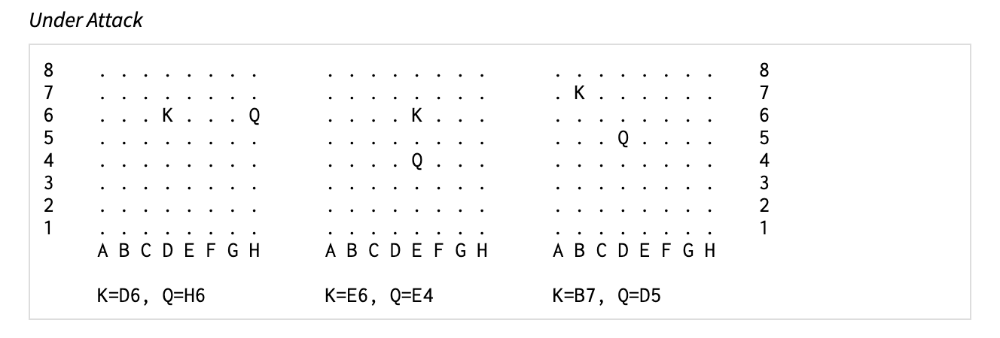
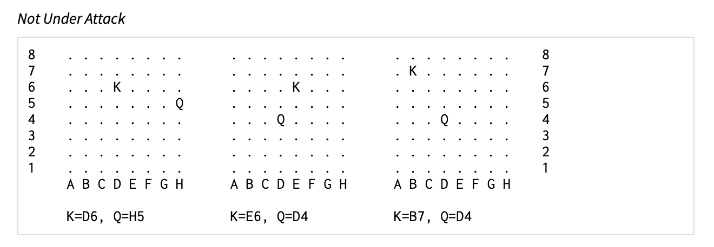

# Chess Detection

__Whiteboard__: Harder

__Challenge__: Medium

----

Given a chessboard with one K and one Q, see if the Q can attack the K.

This function is given coordinates for the king and queen on a chessboard. These coordinates are given as a letter A-H for the columns and 1-8 for the row (see below for example):

Queens can move in any direction: horizontally, vertically, or diagonally, as far as possible.

This function returns True if the king is in the line of attack of the queen.

For example, the first set of boards, __Under Attack__, show the king under attack.



The second set of boards, __Not Under Attack__, do not:



Your function should work like follows:

```python
>>> check("D6", "H6")
True

>>> check("E6", "E4")
True

>>> check("B7", "D5")
True

>>> check("A1", "H8")
True

>>> check("A8", "H1")
True

>>> check("D6", "H7")
False

>>> check("E6", "F4")
False
```

Implement this function.

```python
def check(king, queen):
    """Given a chessboard with one K and one Q, see if the K can attack the Q.

    This function is given coordinates for the king and queen on a chessboard.
    These coordinates are given as a letter A-H for the columns and 1-8 for the
    row, like "D6" and "B7":
    """
```
