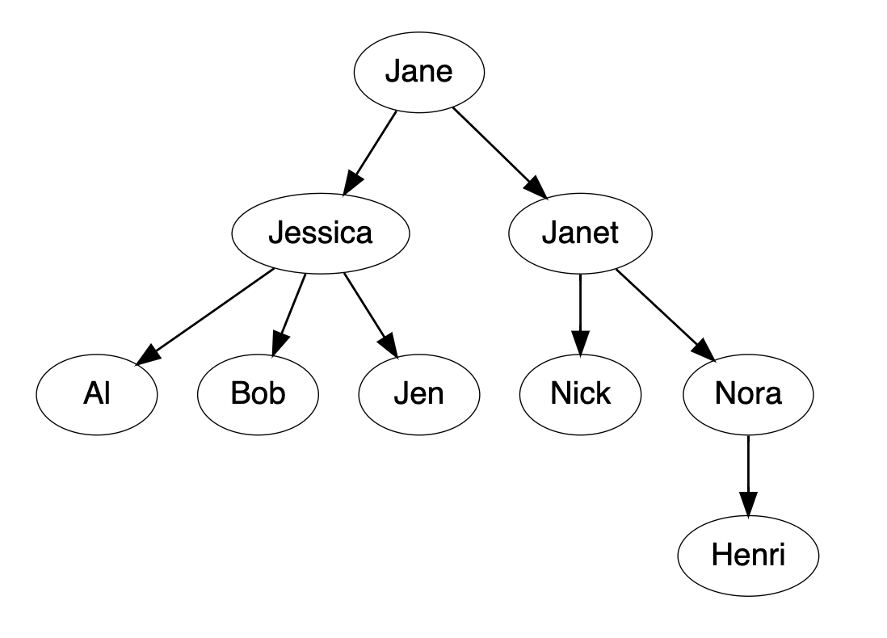

# Count Employees

__Whiteboard__: Harder

__Challenge__: Medium

----

Consider an organization chart like:



This can be represented using nodes in a tree, like this:

```python
>>> henri = Node("Henri")
>>> nora = Node("Nora", [henri])
>>> nick = Node("Nick")
>>> janet = Node("Janet", [nick, nora])
>>> al = Node("Al")
>>> bob = Node("Bob")
>>> jen = Node("Jen")
>>> jessica = Node("Jessica", [al, bob, jen])
>>> jane = Node("Jane", [jessica, janet])
```

Our Node class is:

```python
class Node(object):
    """Node in a tree."""

    def __init__(self, name, children=None):
        self.name = name
        self.children = children or []
```

We want to create a method of our `Node` class, `count_employees`, which returns a count of how many employees this person manages.

This should include everyone under them, not just people who directly report to them.

For three chart above, this would return 0 for Henri, 1 for Nona, and 8 for Jane.

The [countemployees.py](./countemployees.py) file has some test cases that currently fail.

It has a stub implementation of the count_employees:

```python
class Node(object):   # ...
    def count_employees(self):
        """Return a count of how many employees this person manages.

        Return a count of how many people that manager manages. This should
        include *everyone* under them, not just people who directly report to
        them.
        """
```

Implement the count_employees method. When this is successful, all tests should pass.
